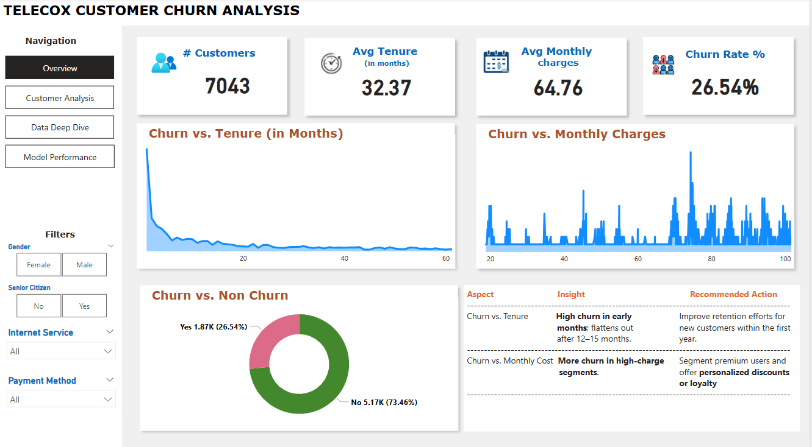
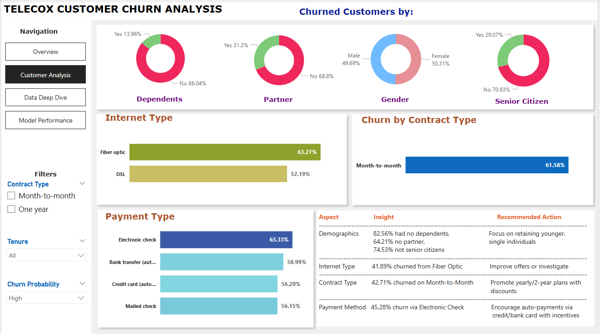
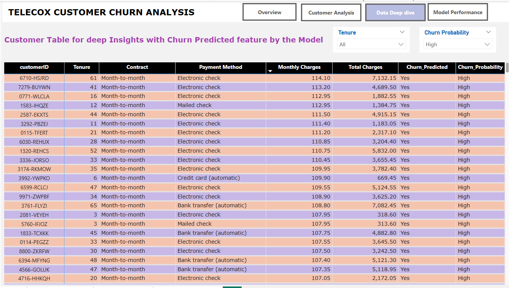
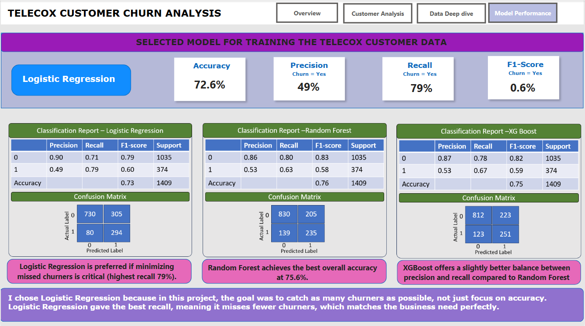

# Telecom Customer Churn Prediction Dashboard
This project presents a comprehensive end-to-end **churn prediction system** for a telecom company using machine learning and Power BI. It includes data preprocessing, model development, churn probability scoring, and interactive visualization for stakeholder insights.

## Problem Statement

Customer churn is a major concern for telecom companies. Retaining existing customers is more cost-effective than acquiring new ones. The goal of this project is to:
- Identify customers likely to churn.
- Understand key factors contributing to churn.
- Help business teams take informed, data-driven retention actions.

## Project Highlights

- **Machine Learning Model**: Trained on Telco customer data to predict churn.
- **Scoring System**: Each customer receives a churn probability.
- **Power BI Dashboard**: Interactive reports designed for business stakeholders.

## Domain Knowledge: Telecom Industry & Churn
In the telecom industry, customer churn refers to the percentage of customers who discontinue their service within a given time period. Churn often results from:

Poor customer service

High service costs

Limited service offerings or flexibility

Competitor promotions

Reducing churn is critical for profitability, especially in saturated markets. Telecom companies use predictive analytics to identify customers at risk and take proactive retention measures.

## Dashboard Pages:
### 1. **Overview** 

### 2. **Customer Analysis**

### 3. **Deep dive Analysis**

### 4. **Model Performance**

## View Project demo:

## Key Insights from Dashboard
Based on the visualizations in the Power BI dashboard:
1. Month-to-Month Contracts have significantly higher churn rates (~43%) compared to One- or Two-Year Contracts.

2. Electronic Check Payment Method customers show the highest churn rate.

3. Customers without internet service churn less – suggesting bundled internet services may impact satisfaction.

4. Tenure is a strong predictor – most churn occurs within the first 12 months of joining.

5. Higher monthly charges correlate with increased churn, especially in month-to-month contracts.

## Business Recommendations
Based on the analysis, the company should consider:

1. **Promote Longer-Term Contracts**

Offer incentives (e.g., discounts, benefits) for switching from month-to-month to 1- or 2-year contracts.

Implement customer onboarding strategies to retain new customers past the first 12 months.

2. **Improve Payment Experience**

Target customers using Electronic Check with reminders or switch offers to autopay/digital wallets.

Simplify payment channels and introduce payment success tracking.

3. **Bundle Internet & Streaming Services**

Customers with multiple services tend to stay longer. Promote packages with value-added features.

4. **Target High Monthly Charge Customers**

Evaluate pricing strategies for high-charge customers; offer usage-based or loyalty pricing.

Personalized offers for customers with high monthly bills and low tenure.

5. **Proactive Retention Strategy**

Use churn probability scores to segment high-risk customers and initiate retention campaigns (calls, discounts, loyalty rewards).

